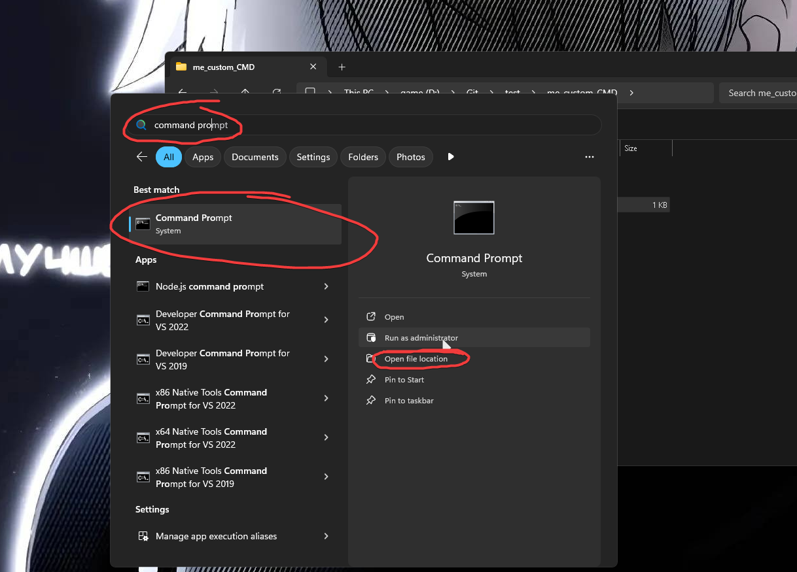
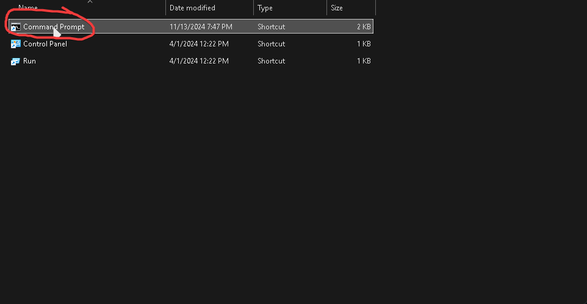
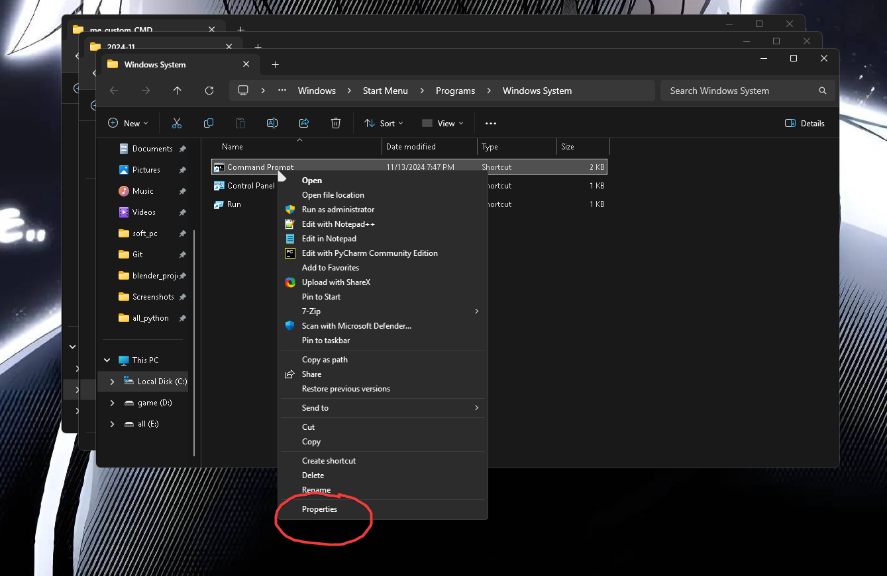
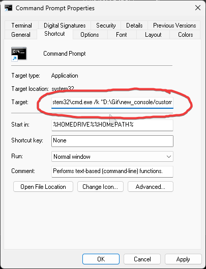
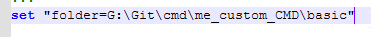
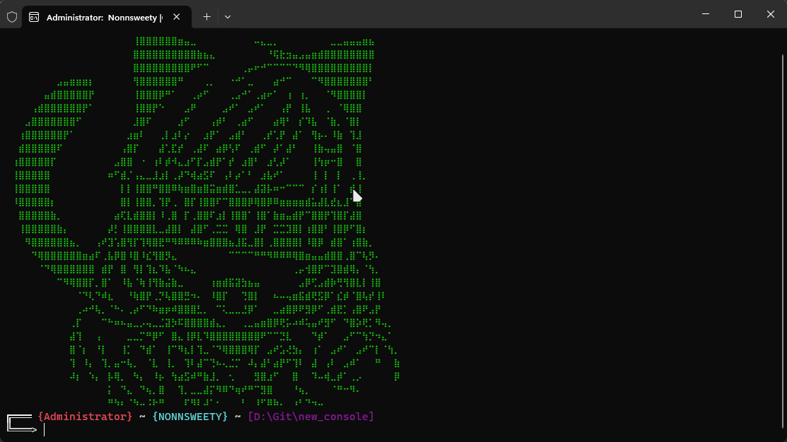
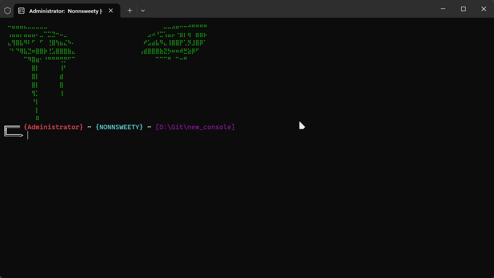

<h1 align="center"> Me custom command prompt </h1>

Это мой custom командной строки и я тут сделал что бы были некотыре функции от linux так как я к ним привык

## :star2: What it is? 

- Есть команды от linux [ls, clear] пока что мало но добавлю ещё
- Красивые ascii art anime 
- Что то новое чем старая комадная строка
- В этом файле есть 10 art ascii и они рандомно выбераются

## other

- как устоновить что бы это было по умолчанию 
## Сперва вам надо в бить в поиск виндовс командная строка 

## Патом вам надо перейти на папку где она лежыть 

## Типерь вам надо нажать пкм по командной строке и перейти в его свойство
 

## И вести в эту строку после того что написано | /k "куда вы распокавали этот файл. Вы должны поставить этот путь"

## :star2: ERROR
- Надо будет поменять путь в коде так как у каждого пользователья он свой и мой может не подайти вам 

- Вот тут поменяйте и все будет ок 

## :star2: Preview

 

